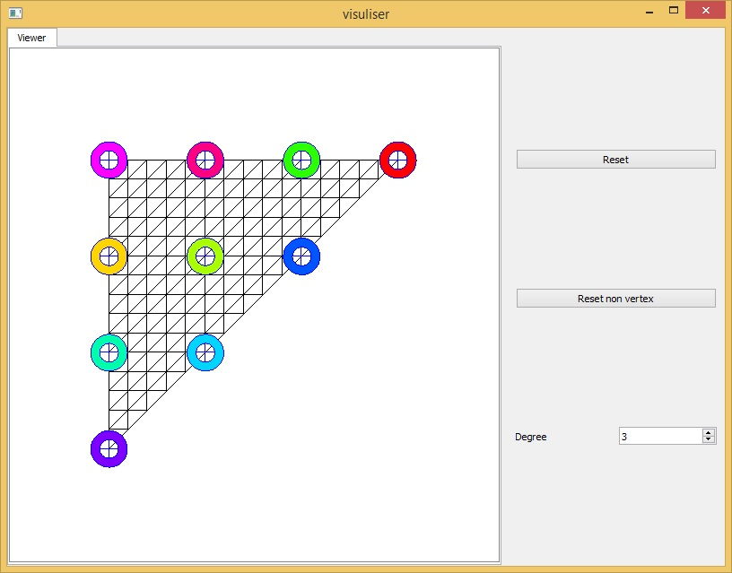
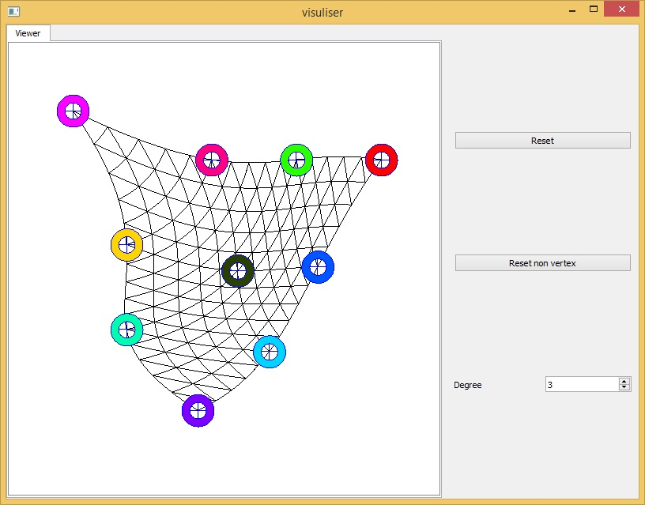
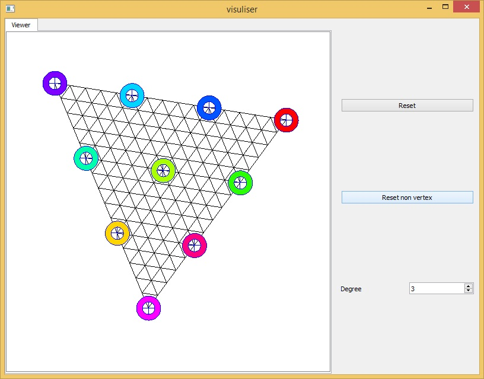
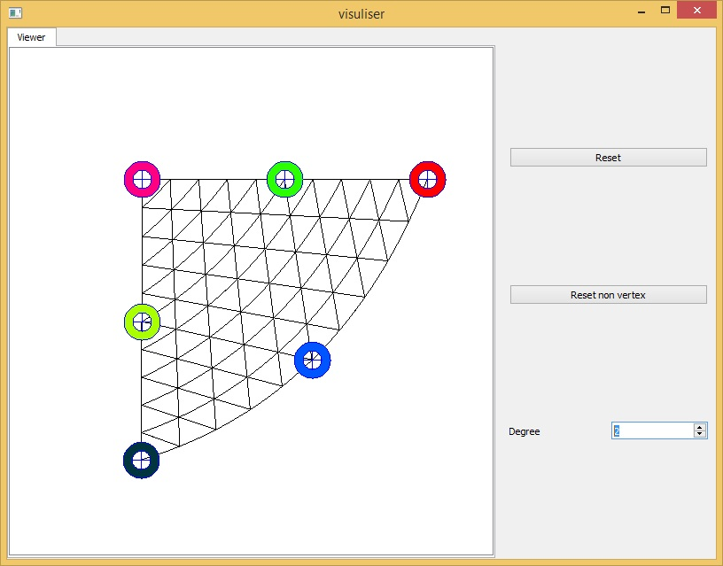
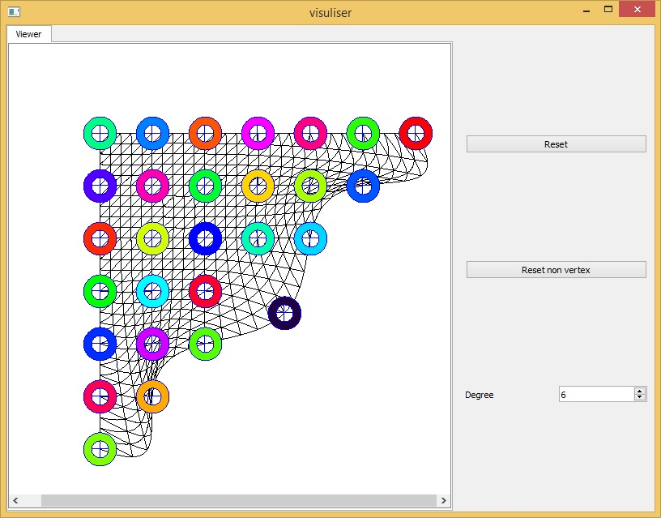

# HighOrderGeometryInterpolation

A simple visualization of langrangian interpolation for element deformation

Currently only triangle element is implemented

[this slide](http://academic.csuohio.edu/duffy_s/CVE_512_11.pdf) is used for lagrangian formular

## interface

###Drag control points to deform the element

### ResetNonVertex will make all control points evenly distributed except for vertices

### Change polynomial degrees

